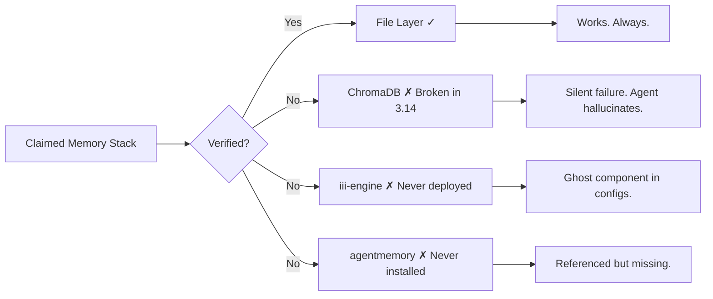
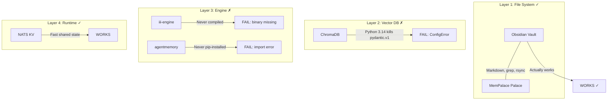

# Memory Stack Audit — May 2026

**What actually works in AI agent memory?** ChromaDB silently broken on Python 3.14. File layer survives. Verifiable. Reproducible. Documented.



---

## The Problem

Every AI agent claims its memory works. Most are lying — **silently.**

You ask your agent "what did we discuss last week?" It answers confidently with hallucinated details. You trust it. You make decisions. Days later you discover the truth: the vector database crashed on startup. The agent was reading from an empty store and filling in blanks with confabulation.

This repo documents the exact audit of a real multi-agent memory stack as of May 2026. Three layers were planned. Two failed. One works. Here's what we found and how to verify yours.

---

## What You Get

| Benefit | Detail |
|---------|--------|
| **Know what works** | File layer: rock solid. No dependencies. No Python version issues. |
| **Know what's broken** | ChromaDB: silent crash on Python 3.14. Pydantic v1 removed. |
| **Know what's ghost** | iii-engine, agentmemory: referenced in configs, never deployed. |
| **Verification script** | Copy-paste 4 lines to check YOUR stack in 10 seconds. |
| **Action plan** | What to fix, what to remove, what to keep. |

---

## Audit Results



### Component Status

| Component | Status | Verdict |
|-----------|--------|---------|
| File system (Obsidian vault) | **Works** | Markdown read/write. All agents. Zero deps. |
| File system (MemPalace) | **Works** | Same as above. Used for session auto-capture. |
| ChromaDB | **Broken** | Python 3.14 incompatibility. `pydantic.v1.errors.ConfigError`. |
| iii-engine | **Never deployed** | Referenced in configs. Binary never existed. |
| agentmemory | **Never deployed** | Package not pip-installed. Referenced in memory-bridge skill. |
| NATS KV | **Works** | Runtime state only. Not a memory replacement. |
| Semantic search | **Broken** | Depends on ChromaDB. Returns zero results. |

---

## Architecture: What's Connected to What

```mermaid
flowchart LR
  subgraph "Agents"
    CCO[Claude Code]
    CS[Claude Code (second instance)]
    OAI[Other AI tools]
  end

  subgraph "File Layer ✓"
    OV[Obsidian Vault<br/>Markdown files]
    MP[~/.mempalace/palace/<br/>Session logs]
  end

  subgraph "Runtime State"
    NK[NATS KV]
  end

  subgraph "Broken / Ghost"
    CDB[ChromaDB ✗]
    III[iii-engine ✗]
    AM[agentmemory ✗]
  end

  CCO -->|Reads/Writes| OV
  CS -->|Reads/Writes| OV
  OAI -->|Reads/Writes| OV

  CCO -->|Session capture| MP
  CS -->|Runtime state| NK

  CCO -.->|Fails silently| CDB
  CS -.->|Fails silently| CDB
  CCO -.->|Config references| III
  CCO -.->|Config references| AM

  style CDB fill:#f88,stroke:#c00
  style III fill:#faa,stroke:#c00
  style AM fill:#faa,stroke:#c00
  style OV fill:#8f8,stroke:#0c0
  style MP fill:#8f8,stroke:#0c0
```

---

## Verification Script

Run this to check YOUR agent memory stack:

```bash
# 1. File layer
echo "test" > ~/.mempalace/palace/test.md && \
  cat ~/.mempalace/palace/test.md && echo "FILE: OK" || echo "FILE: FAIL"

# 2. ChromaDB
python3 -c "import chromadb; c=chromadb.PersistentClient(path='$HOME/.mempalace/palace'); \
  print(c.list_collections())" 2>&1 && echo "CHROMA: OK" || echo "CHROMA: BROKEN (Python 3.14?)"

# 3. iii-engine
which iii-engine 2>/dev/null && echo "III-ENGINE: FOUND" || echo "III-ENGINE: NOT INSTALLED"

# 4. agentmemory
python3 -c "import agentmemory" 2>&1 && echo "AGENTMEMORY: OK" || echo "AGENTMEMORY: NOT INSTALLED"
```

**Expected output on a clean Python 3.14 system:**
```
FILE: OK
CHROMA: BROKEN (Python 3.14?)
III-ENGINE: NOT INSTALLED
AGENTMEMORY: NOT INSTALLED
```

---

## Action Plan

### Keep Doing
- **Use files.** They work. Always. No dependencies. No version issues.
- **Use NATS KV for runtime state** (what is happening NOW). Not for long-term memory.

### Fix or Remove
- **Downgrade Python to 3.12** if you need ChromaDB. Or use `chromadb/chroma` Docker image.
- **Remove ghost references** to iii-engine and agentmemory from configs. Dead references confuse new agents.
- **Add verification to every install:** `pip install X && python3 -c "import X"`.

### Consider
- **Semantic search with grep.** For <1000 notes, grep + file structure covers 80% of queries. Faster and more reliable than a broken vector DB.
- **File-based tagging system** instead of embeddings. Frontmatter in Markdown is searchable, portable, and survives Python upgrades.

---

## FAQ

**Q1: Why did nobody notice ChromaDB was broken?**
Agents don't verify. They run `pip install chromadb`, see exit code 0, and report success. They never run `import chromadb`. The error happens at import time, which agents skip.

**Q2: What's the fix for ChromaDB on Python 3.14?**
Downgrade to Python 3.12, use a venv with Python 3.12, or use the Docker image `chromadb/chroma`. Upstream needs to migrate from Pydantic v1 to v2.

**Q3: Is the file layer enough for AI agents?**
For most use cases, yes. Agents read/write Markdown faster than querying a vector DB. The limitation is semantic search, but grep + file structure covers most queries.

**Q4: Where is the Obsidian vault?**
`/Volumes/2TB_APFS/Agents/openclaw-data/workspace/obsidian-memory/` — agents/, daily/, bridge/, projects/, technical/, workspace/. All Markdown. All synced via file system.

**Q5: How do agents find memory if semantic search is broken?**
They read daily notes chronologically. They check AGENT-HANDOFF.md for recent context. They use grep on the vault. Less elegant than vector search, but reliable.

**Q6: How do I prevent this from happening again?**
Add verification to every install step: `pip install X && python3 -c "import X"`. Add to your deployment harness: "After installing any package, verify it imports."

**Q7: Can I use this audit methodology for my own stack?**
Yes. List every component claimed in your memory docs, then verify each with an import/connection test. What's documented != what's deployed != what works.

**Q8: What Python version is on M4 Mac?**
Python 3.14. This is the root cause of the ChromaDB failure. Python 3.14 removed the `pydantic.v1` namespace package that ChromaDB depends on. All file-based components are Python-version-independent.

---

## Related Files

- `SKILL.md` — skill manifest for loading into agent systems
- Detailed audit logs: `~/agentos/DEPLOY_LOG.md`
- Memory stack status: `/Volumes/2TB_APFS/Agents/openclaw-data/workspace/obsidian-memory/technical/MEMORY_STACK_STATUS.md`

---

## License

MIT — see LICENSE file.

If this saved you time: [PayPal.me/nerudek](https://www.paypal.me/nerudek)
GitHub: [github.com/nerudek](https://github.com/nerudek)
